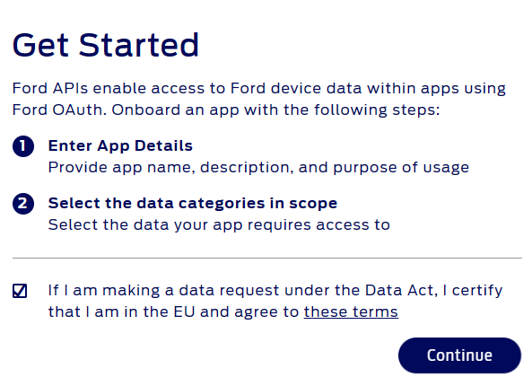
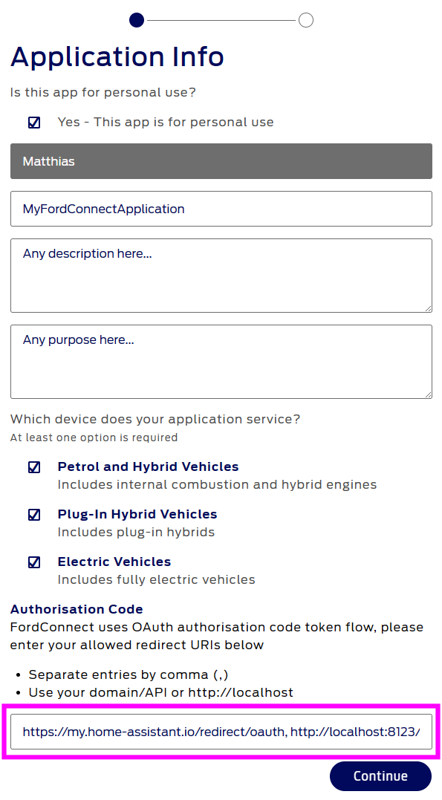
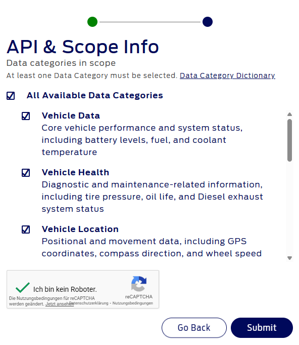
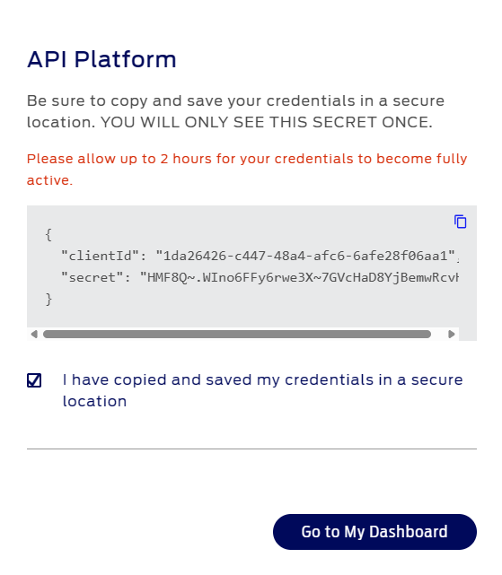

## I: Register a Ford Developer Account

## II: Register an (OAuth) Application with Ford
1. Make sure you are logged in to your ford developer account – if you don't have one, you can register one for free (MFA required)
2. Open https://developer.ford.com/developer-eu  
3. Check the box '_I am making a data request under Data Act,..._'  (if this is valid for you) and press the _Continue_ button  
4. Check the box '_Yes - This app is for personal use_'
5. Specify any _application name_, any _description_ and any _purpose_
6. Check all the different vehicle types
7. Specify the following URL as the redirect URL in the _Authorization Code_ (purple-marked box):
   - `https://my.home-assistant.io/redirect/oauth`

   _If you like you can add also additional URLs, but have in mind, they must be either `localhost` or reachable from the public internet (specify a local IP like `http://192.168.1.100` will cause an error message in step 9)._

   So when you e.g. what additionally to the required one the URL `http://localhost:8123/auth/external/callback`, then use `https://my.home-assistant.io/redirect/oauth, http://localhost:8123/auth/external/callback` as input.
8. Press _Continue_  
9. Check the _All Available Data Categories_, check that _you are not a robot_ (don't cheat) and press _Submit_ 
10. Finally, you have your _Client ID_ and _Client Secret_, save them at a secure place. We will need them shortly. _If this dialog does not appear, then the check if the specified URL is failing. Please double-check that the URL that you might have specified additionally to `https://my.home-assistant.io/redirect/oauth` is reachable from the Ford backend system._
