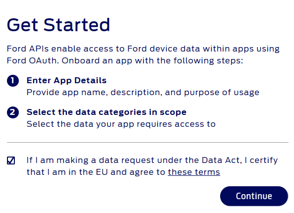
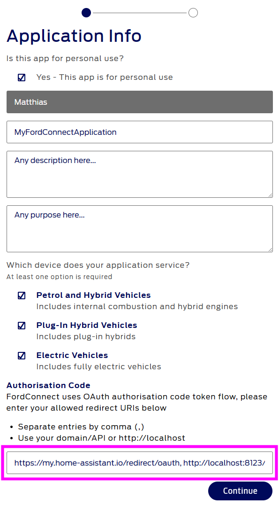
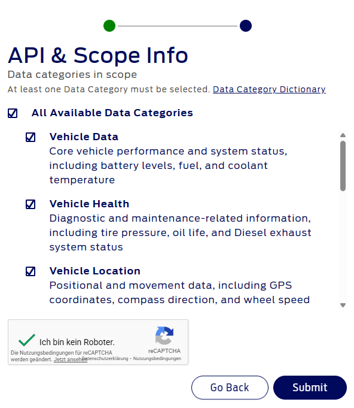
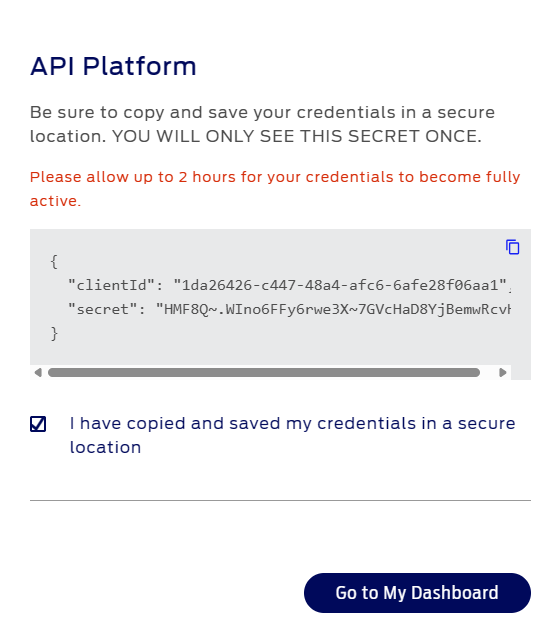

## I: Register and prepare a Ford Developer Account
1. If you don't have a Ford developer account yet, you can register one for free (MFA required) by going to https://developer.ford.com/, select sign-in (upper right corner) and then click on the 'Register' link.
2. Make sure that your Ford developer account is __verified__ and __active__.
3. To avoid problems with the upcoming application registration process, make sure that in your account profile name __does not contain _special_ characters__. Only the following characters should be used: __a-z__, __A-Z__, __0–9__ and __spaces__. You can [change your profile name at the my-account section of the Ford developer portal](https://developer.ford.com/my-developer-account/my-profile).

## II: Register an (OAuth) Application with Ford
4. Open one of the following URLs in your browser (you must be logged in to your Ford developer account):
   - https://developer.ford.com/developer-eu (for countries of the __European Union__)
   - https://developer.ford.com/developer-uk (for the __United Kingdom__)
   - https://developer.ford.com/developer-na (for __North America__ – this might also work for the rest of the world) <table><tr><td></td></tr></table>
5. __FOR EU ONLY__: Check the box '_I am making a data request under Data Act,..._'  (if this is valid for you) and press the _Continue_ button.

6. Check the box '_Yes - This app is for personal use_'
7. Specify any _application name_, any _description_ and any _purpose_ _Based on user feedback, looks like, that **_any_** is not the correct term here: It's recommended to __only use__: 0-9,A-Z,a-z, (space) or \_ (underscore)._ <table><tr><td></td></tr></table>
8. Check all the different vehicle types
9. Specify the following URL as the redirect URL in the _Authorization Code_ (purple-marked box):
   - `https://my.home-assistant.io/redirect/oauth`

    _If you like you can add also additional URLs, but have in mind, they must be either `localhost` or reachable from the public internet (specify a local IP like `http://192.168.1.100` will cause an error message in step 9)._

    When you e.g., want to use additioallly the URL `http://localhost:8123/auth/external/callback`, then use `https://my.home-assistant.io/redirect/oauth, http://localhost:8123/auth/external/callback` as input.

    When your HA instance is reachable via the public internet, then __do not it its external URL here, you must always include my.home-assistant.io__. Please be so kind and [read the additional information from the main readme.md](../README.md#user-content-additional-information-about-application-registration-at-ford-and-your-local-ha-instance)  

10. Press _Continue_ <table><tr><td></td></tr></table>
11. Check the _All Available Data Categories_, check that _you are not a robot_ (don't cheat) and press _Submit_ <table><tr><td></td></tr></table>
12. Finally, you have your _Client ID_ and _Client Secret_, save them at a secure place. We will need them shortly. _If this dialog does not appear, then the check if the specified URL is failing. Please double-check that the URL that you might have specified additionally to `https://my.home-assistant.io/redirect/oauth` is reachable from the Ford backend system._

### Having issues with the registration?
Please note that I just wrote this guide to make it easier for you to get started. At the end of the day this is a service from Ford, provided by Ford, implemented by Ford, running by Ford. So you might, can already guess that __I am not able to provide any help or support here__.

All my experience I have collected when registering an application is documented here in this REGISTER_APPLICATION.md file. There have been reports that the registration process has not been working properly for _unknown_ reasons – waiting a couple of hours or even days had helped in some cases. But at the end of the day __contact Ford directly if you have issues with the application registration process__.

### Continue with the configuration
Now you should wait at least 2h for the Ford backend system to process your request. Then you can continue with the configuration as it's described in the [integration Setup Guide](CONFIGURE_INTEGRATION.md)